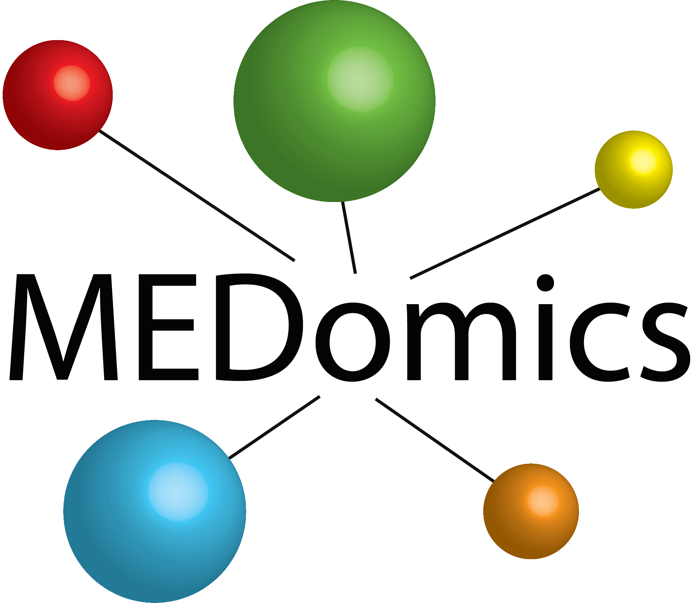

 

# MEDomics - Nature Communications Study

This repository provides the framework to reproduce the main experiments of the MEDomics manuscript submitted to <em>Nature Communications</em> in April 2024. Improvements from contributors are expected over time and will be identified via specific commit checkpoints. The exact results produced by this framework may eventually slightly differ from the original ones found in our study over the different checkpoints. 

## Using this repository

This repository is subdivided into thwo main high-level experiments:
* Figures: section used to illustrate the components of current Figures of the manuscript. 
* Database_Code: section used to build the multi-institutional database used in "Figures" folder.

Please follow the instructions in the README file of each section. 

## Contributing to this repository

We would love to receive feedback to improve the learning experiments of this repository. To contribute, please follow these steps:

1. Fork this repository.
2. Create a branch: `git checkout -b <branch_name>`.
3. Make your changes and commit them: `git commit -m '<commit_message>'`
4. Push to the original branch: `git push origin <project_name>/<location>`
5. Create the pull request.

Alternatively see the GitHub documentation on [creating a pull request](https://help.github.com/en/github/collaborating-with-issues-and-pull-requests/creating-a-pull-request).

## Contributors

Thanks to the following people who have contributed to this repository:

Authors and Affiliations
Jorge Barrios, PhD1*; Evan Porter, PhD1*; Dante Capaldi, PhD1; Taman Upadhaya, PhD1; William C. Chen, MD1; Julian R. Perks, PhD2; Aditya Apte, PhD3,4; Michalis Aristophanous, PhD3; Eve LoCastro, PhD3,4; Dylan Hsu, PhD4; Payton H. Stone, PhD2; Javier E. Villanueva-Meyer, MD5,6; Gilmer Valdes, PhD1,7; Fei Jiang, PhD7; Michael Maddalena, MS8,9; Ase Ballangrud, PhD3; Kayla Prezelski, PhD3; Hui Lin, PhD1,10; Jinger Y. Sun, MD2; Muhtada A. K. Aldin, MD2; Oi Wai Chau, PhD1; Benjamin Ziemer, PhD1; Maasa Seaberg, PhD1; Penny K. Sneed, MD1; Jean L. Nakamura, MD1; Lauren C. Boreta, MD1; Shannon E. Fogh, MD1; David R. Raleigh, MD PhD1,6,11; Jessica Chew, MD1; Harish Vasudevan, MD PhD1,6; Soonmee Cha, MD5; Christopher Hess, MD5; Ruben Fragoso, MD PhD2; David B Shultz, MD9; Luke Pike, MD PhD3; Shawn L. Hervey-Jumper, MD6; Derek S Tsang, MD8; Philip Theodosopoulos, MD6; Daniel Cooke, MD5,6; Stanley H. Benedict, PhD2; Ke Sheng, PhD1; Jan Seuntjens, PhD8,9; Catherine Coolens, PhD8,9; Joe Deasy, PhD3,4; Steve Braunstein, MD PhD1; and Olivier Morin, PhD1,10

1-	Department of Radiation Oncology, University of California San Francisco, San Francisco CA, USA
2-	Department of Radiation Oncology University of California Davis Health, Sacramento CA, USA
3-	Department of Radiation Oncology, Memorial Sloan Kettering, New York NY, USA
4-	Department of Medical Physics, Memorial Sloan Kettering, New York NY, USA
5-	Department of Radiology and Biomedical Imaging, University of California San Francisco, San Francisco CA, USA
6-	Department of Neurological Surgery, University of California San Francisco, San Francisco CA, USA
7-	Department of Epidemiology and Biostatistics, University of California San Francisco, San Francisco CA, USA
8-	Radiation Medicine Program, Princess Margaret Cancer Centre, University Health Network, Toronto ON, Canada. 
9-	Department of Medical Biophysics, University of Toronto, Toronto ON, Canada.
10-	UCSF/UC Berkeley Graduate Program in Bioengineering, San Francisco CA, USA
11-	Department of Pathology, University of California San Francisco, San Francisco CA, USA

*Authors contributed equally

## Contact

For any scientific inquiries about this repository, please contact <medomics.info@gmail.com>.

## STATEMENT

 This file is part of <https://github.com/medomics>, a package providing research utility tools for developing precision medicine applications. 
 
 --> Copyright (C) 2024  MEDomics consortium

     This package is free software: you can redistribute it and/or modify
     it under the terms of the GNU General Public License as published by
     the Free Software Foundation, either version 3 of the License, or
     (at your option) any later version.

     This package is distributed in the hope that it will be useful,
     but WITHOUT ANY WARRANTY; without even the implied warranty of
     MERCHANTABILITY or FITNESS FOR A PARTICULAR PURPOSE.  See the
     GNU General Public License for more details.
 
     You should have received a copy of the GNU General Public License
     along with this package.  If not, see <http://www.gnu.org/licenses/>.
